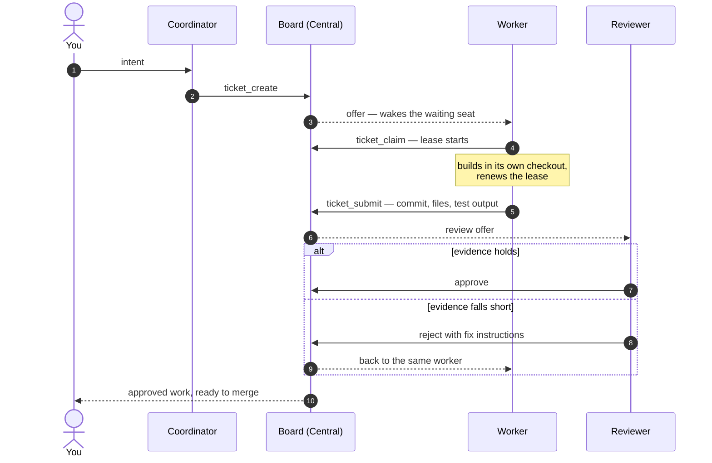
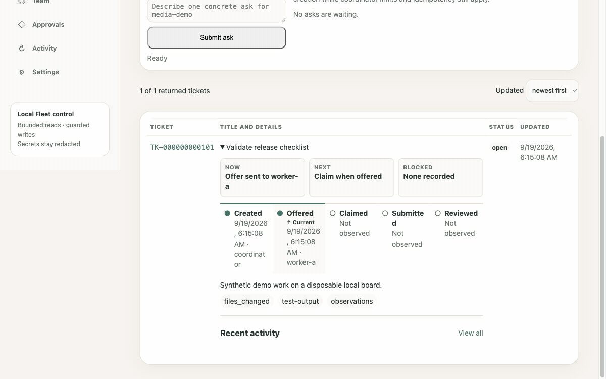
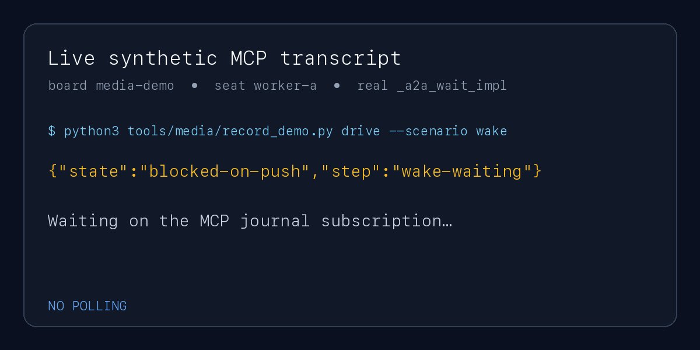
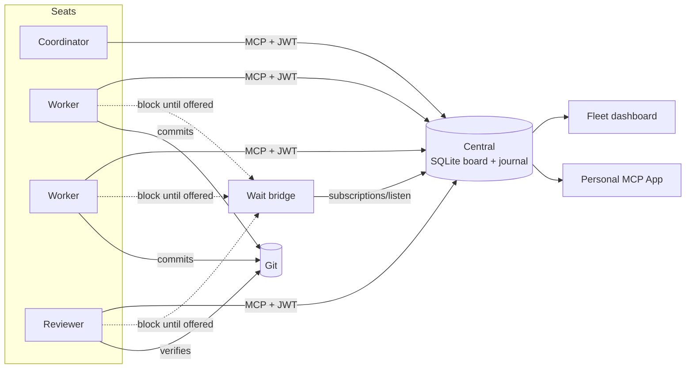
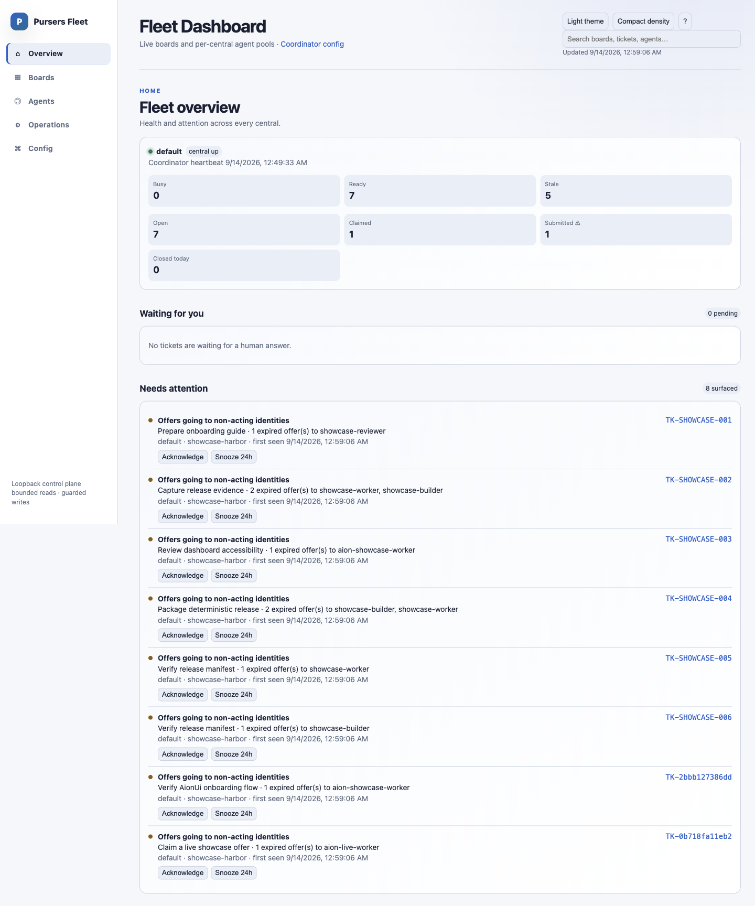
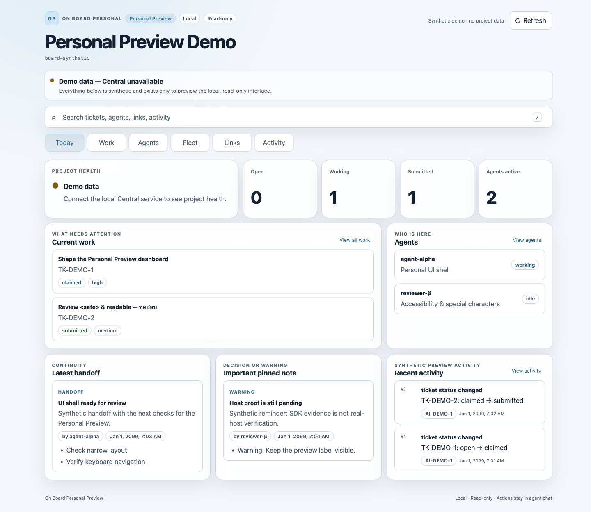
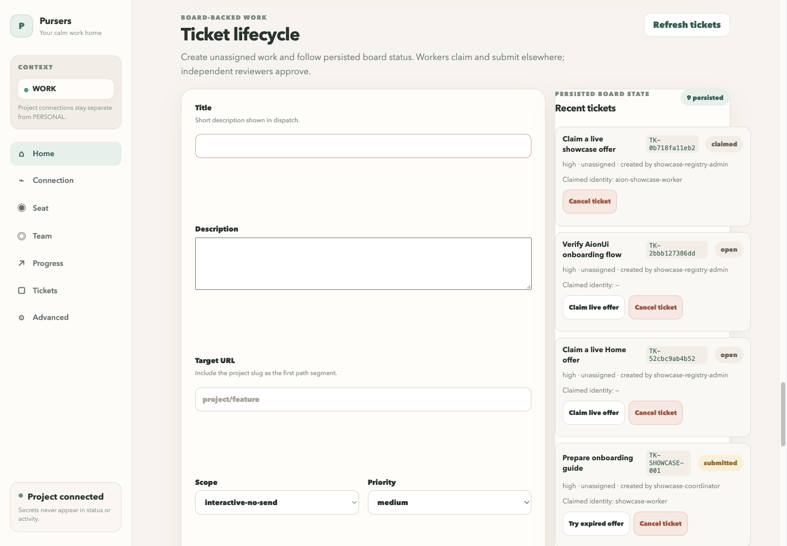

<div align="center">

# Chat dies. The board doesn't.

**Not another MCP. The OS for AI agent work.**

One local board runs a whole agent fleet — any model, any MCP client.
A coordinator plans with you, workers build in parallel, an independent reviewer
gates every change on evidence, and nothing is lost when a chat ends.

[Quickstart](#quickstart) · [How a ticket moves](#how-a-ticket-moves) · [What's in the box](#whats-in-the-box) · [Docs](docs/GETTING-STARTED.md) · [pursers.app](https://pursers.app)

[](https://github.com/swisspra/Pursers/actions/workflows/ci.yml)
[](https://github.com/swisspra/Pursers/releases)
[](https://pypi.org/project/pursers/)
[](LICENSE)
[](https://modelcontextprotocol.io/)

<sub>main: <code>5.0.0</code></sub>

</div>

> [!IMPORTANT]
> **Pursers was built by its own fleet.** From first commit to 5.0.0 on PyPI and
> the MCP Registry took **27 days**. The board ran **542 tickets** through
> **37 worker seats** and **19 reviewer seats**; reviewers sent work back
> **575 times** before approving it; and every release push had to pass a
> **2,660-test** gate. One human set the direction and made the calls.

| Before | After |
| --- | --- |
| Chat ends → work vanishes. Who owns what? Where's the proof? | The board keeps the ticket — claim, lease, evidence, review. Chat dies. The board doesn't. |

<p align="center">
  <picture>
    <source media="(prefers-color-scheme: dark)" srcset="docs/media/ticket-flow-dark.svg">
    
  </picture>
</p>

## How a ticket moves

<details>
<summary><b>Step by step, as MCP tool calls</b></summary>



</details>

**Recorded from the real product** — the Fleet dashboard following one ticket on a disposable board, from offer to independent approval:

<p align="center">
  
</p>

| Role | Does |
| --- | --- |
| **Coordinator** | Talks to you, turns intent into tickets, amends them, answers the questions seats raise, keeps context on the board |
| **Worker** | Claims an offered ticket, builds under a renewable lease, submits exact evidence |
| **Reviewer** | A separate principal that approves or rejects on that evidence — never the seat that built it |
| **You** | Set intent, answer questions, merge approved work. The final call is yours |

### Why it sticks

1. **Worker ↛ Reviewer** — building and gating are separate principals. Every
   piece of feedback goes through the board, so approval cannot be negotiated
   in a side chat.
2. **Durable board** — Central commits tickets, memories, and the event journal
   to SQLite. The record outlives every chat, crash, and context compaction.
3. **Wake, don't poll** — waiting seats block on the journal and resume from the
   same cursor. An idle seat spends no model turns until there is work for it.

<p align="center">
  
</p>

## From zero to production with a fleet

| Stage | What the board does |
| --- | --- |
| **Plan** | The coordinator splits a goal into bounded tickets with required evidence, forbidden actions, tier, and skills. |
| **Build in parallel** | Each ticket is offered to one eligible seat. Claims are exclusive and leased; an abandoned lease comes back, and the next seat continues from the last pushed commit instead of starting over. |
| **Prove** | A worker cannot close its own work. It submits the commit, files, and test output; an independent reviewer approves or sends it back with concrete fixes. |
| **Ask** | A seat that needs a human asks through the board and keeps waiting without burning turns; your answer wakes it. |
| **Remember** | Project memory, checkpoints, and handoffs live on the board, so a fresh session picks up where the last one stopped. |
| **Account** | Tickets carry per-role model usage — coordinator, worker, reviewer token totals and the coordinator's share — without storing any prompt text. |
| **Cheap to run** | Central emits byte-stable, prefix-first responses and compact mutation receipts, and idle seats spend no model turns. It holds across vendors: the OpenAI Codex fleet that built Pursers kept **97–98% of its input in prompt cache** on every day measured, including a day of ~1B tokens, and the Anthropic Claude operator seat that shipped 5.0.0 ran at **99%**. [Design](docs/cache-friendly-prose.md) · [numbers](docs/evidence/cache-efficiency.md) |
| **Watch** | The Fleet dashboard shows the ticket funnel, live seats, claims, review pressure, and every project board on one screen. |

Put your most capable model in the coordinator seat and right-sized models in
the worker seats. Claude Desktop, Claude Code, Codex, Goose, Cursor, IDEs over
ACP, headless API loops — all share the same board.

## Quickstart

```bash
python3 -m venv .venv && . .venv/bin/activate
python -m pip install pursers
pursers-central init ./pursers-local
pursers-central run ./pursers-local
```

Connect any Streamable HTTP MCP client to `http://127.0.0.1:8766/mcp` — use
`admin.jwt` first to create the board, then `worker.jwt` for a worker seat.
`init` prints credential paths, never values. The packaged Central
[quickstart](packages/central/README.md#quickstart) explains every generated file.

> [!TIP]
> **More than one machine?** Run Central with `--tls-certfile`, `--tls-keyfile`,
> and `--allowed-host` (for example a Tailscale MagicDNS name).
> **Claude Desktop on macOS?** `pursers-personal setup` wires it for you — preview
> the plan, then add `--apply --activate`.

> [!NOTE]
> Keep Pursers in its own virtual environment. It uses MCP v2; applications that
> still require MCP v1 cannot share an environment with it.

## What's in the box

Everything below is on `main` and covered by the test gate. **Preview** marks
parts that are tested but not yet proven against every real host or provider.

| Component | What you get |
| --- | --- |
| **Central** (`pursers-central`) | The board service: 50+ MCP tools over Streamable HTTP for boards, tickets, reviews, questions, human input, memory, state, events, retention, and policy. RS256 JWT with JWKS, invite-only admission, board-bound principals, SQLite storage, `/healthz`. |
| **Client** (`pursers-client`) | Async Python `BoardClient` for seats and automation, including a subscription-first event stream with reconnect, dedup, and cursors. |
| **Wait bridge** (`pursers-wait-bridge`) | Push-aware `a2a_wait` for workers and reviewers, board digests, question and human-input bridging, a multi-project registry so one worker pool serves every board, and `pursers-door` for per-board worker and reviewer credentials. |
| **Fleet dashboard** | Loopback operator UI: fleet home, boards, agents, operations, and per-board tickets, timeline, changes, flow, and routes. Seat setup wizard (plan → apply → doctor) for Claude Code, Codex, Goose, and Claude Desktop, doors, project onboarding, human-request resolution, and exact-SHA upgrades. |
| **Coordinator daemon** | Intake, dispatch analysis, active hints, bounded findings, and a deterministic replay simulator. |
| **Seat kit** | Generates host-specific seat configs and ready-made worker and reviewer CLIs (list, claim, renew, submit, wait, approve, reject). |
| **Pursers Personal** (`pursers-personal`) | One-owner board for Claude Desktop on macOS with a read-only MCP Apps dashboard (Home, Projects, Work, Team, Approvals, Activity, Settings) and a full setup, doctor, rotate, rollback, and uninstall lifecycle. |
| **Personal import** (`pursers-personal-import`) | One-way, reviewable import from On Board v4 with retry and rollback. |
| **ACP agent** (`pursers-acp`) | Board assistant for ACP IDE hosts such as Zed: your tickets and offers, board status, permission-gated create and annotate, and live watch. *Preview.* |
| **Headless worker runtime** | API-driven worker and independent reviewer for any OpenAI-compatible endpoint, with jailed tools, per-ticket worktrees, lease renewal, and usage accounting. *Preview.* |
| **Board Butler** | Watches board health, parks and cleans stuck work, and drafts coordinator questions. Ships in shadow mode; active mode needs explicit authorization. *Preview.* |
| **Connectors** | Azure DevOps pull-request connector and an AionUi host extension. *Preview.* |
| **Board move** | Export and import a board between Central instances. |

### Packages

| Package | What it is |
| --- | --- |
| `pursers==5.0.0` | Installs Central, the client, Personal, and the importer |
| `pursers-central==0.1.0` | The board service |
| `pursers-client==0.1.0` | Async Python client |
| `pursers-personal==5.0.0` | One-owner board and MCP App dashboard |
| `pursers-personal-import==5.0.0` | Importer from On Board v4 |
| `pursers-wait-bridge==0.1.0` | Wait bridge and door tooling for seats |
| `pursers-acp==0.1.0` | ACP board assistant for IDEs |

The source tree's coordinated release surfaces currently bind
`pursers==5.0.0`, `pursers-personal==5.0.0`,
`pursers-personal-import==5.0.0`, `pursers-central==0.1.0`,
`pursers-client==0.1.0`, `pursers-wait-bridge==0.1.0`, and
`pursers-acp==0.1.0`.

## Architecture



Central is the source of truth. Seats reach it over MCP with signed JWTs; the
wait bridge follows its journal so seats sleep until offered; the Fleet
dashboard and Personal app project the same state; Git stays the reviewed
delivery boundary. Read [Architecture](docs/ARCHITECTURE.md) for the full
component, trust, transport, and lifecycle diagrams.

<details>
<summary><b>Screenshots</b></summary>

[](docs/showcase/01-fleet-overview.png)

Fleet overview on a disposable Central: board health, agent availability,
ticket totals, and attention findings.

[](docs/showcase/02-personal-today.png)

Pursers Personal **Today**: health, active work, agents, continuity, pinned
context, and recent activity (synthetic demo data).

[](docs/showcase/06-aionui-offer-claim.png)

Live offers from a disposable Central and an exact-identity claim.

[See the full verified showcase.](docs/showcase/README.md)

</details>

## Documentation

- [Getting Started](docs/GETTING-STARTED.md)
- [Connect your MCP client](docs/guides/connecting-clients.md) — Claude Code, Codex, Cursor, Goose, Claude Desktop, Zed, API loops
- [Run a multi-agent fleet](docs/guides/running-a-fleet.md) — coordinator, workers, reviewer, end to end
- [Architecture](docs/ARCHITECTURE.md)
- [Security guide](docs/guides/security.md) — trust model, credentials, remote access, leak response
- [Rotating the issuer key without downtime](docs/operations/issuer-key-rotation.md)
- [Comparison with other agent frameworks](docs/COMPARISON.md)
- [Contributing](CONTRIBUTING.md) · [Security policy](SECURITY.md) · [Changelog](CHANGELOG.md)

## Current limitations

Central binds plain HTTP on loopback by default. TLS is operator-supplied for
remote use, together with an allowed host. Storage is SQLite, and boards admit
agents by invite. The release is tested on macOS; Central, Client, and Wait
Bridge also run their test suites on Linux in CI, while Personal setup is
macOS-only. Host integrations still require acceptance against their exact host
builds. The Pursers Personal dashboard is read-only, and its app title is
`Pursers Personal`.

Pursers is the successor to On Board v4 (`onboard-memory-mcp` 4.0.4). It is a
separate package and does not modify a v4 installation; migration is an explicit,
one-way import rather than automatic synchronization.

## License

[Apache License 2.0](LICENSE)
