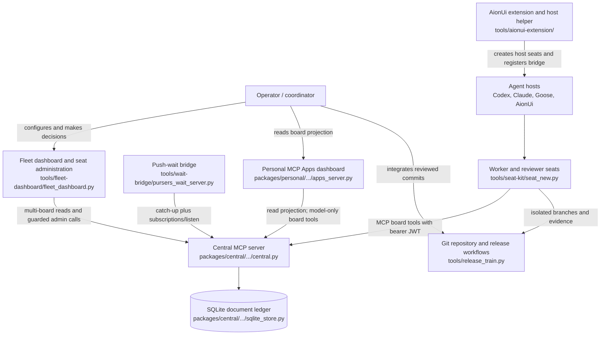

# Pursers architecture

Pursers is a local-first coordination system whose authoritative state lives in
Central. Agents use MCP tools to join boards, exchange durable context, and move
tickets through work and review; dashboards and the AionUi extension are clients
of those same interfaces. ([Central](../packages/central/src/pursers_central/central.py),
[client](../packages/client/src/pursers_client/client.py),
[Personal Apps server](../packages/personal/src/pursers_personal/apps_server.py))

## System context



The diagram's Central, seat, wait, Personal, Fleet, AionUi, and release
relationships come from
[`central.py`](../packages/central/src/pursers_central/central.py),
[`seat_new.py`](../tools/seat-kit/seat_new.py),
[`pursers_wait_server.py`](../tools/wait-bridge/pursers_wait_server.py),
[`apps_server.py`](../packages/personal/src/pursers_personal/apps_server.py),
[`fleet_dashboard.py`](../tools/fleet-dashboard/fleet_dashboard.py),
[`aion-extension.json`](../tools/aionui-extension/aion-extension.json), and
[`release_train.py`](../tools/release_train.py).

## Components

| Component | Responsibility | Source |
| --- | --- | --- |
| Central board server | Exposes MCP tools for admission, board state, tickets, questions, memories, dispatch, leases, and reviews; publishes resource-update cues after durable writes. | [`central.py`](../packages/central/src/pursers_central/central.py) |
| SQLite ledger | Stores logical JSON documents in a `documents(path, doc, version)` table, uses WAL and full synchronous writes, and reuses one `BEGIN IMMEDIATE` transaction across nested board/archive writes. | [`sqlite_store.py`](../packages/central/src/pursers_central/sqlite_store.py), [`transactional_sqlite.py`](../packages/central/src/pursers_central/transactional_sqlite.py) |
| Principal and JWT admission | Verifies RS256 JWTs from a reloadable JWKS; derives a principal from `client_id`, issuer, and subject; then applies token scopes plus board membership. | [`jwt_verifier.py`](../packages/central/src/pursers_central/jwt_verifier.py), [`central.py`](../packages/central/src/pursers_central/central.py) |
| Ticket workflow | Creates tickets, records offers and claims, renews work/review leases, stores submissions, and records approval or retryable rejection history. | [`central.py`](../packages/central/src/pursers_central/central.py) |
| Coordinator context | Keeps bounded, attributed annotations on tickets and durable question records that a registered project coordinator can accept or answer without changing ticket state. | [`central.py`](../packages/central/src/pursers_central/central.py) |
| Dispatcher | Matches open work and submitted reviews to live seats by role, capability, tier, skill, preference, exclusion, and availability; expired offers can requeue or fall back to broadcast. | [`central.py`](../packages/central/src/pursers_central/central.py) |
| Journal and cursors | Appends monotonic per-board semantic events and stores acknowledged cursors by principal, agent name, and board. | [`journal.py`](../packages/central/src/pursers_central/journal.py), [`cursor.py`](../packages/central/src/pursers_central/cursor.py) |
| Push-wait bridge | Runs as a stdio MCP server, performs authoritative bounded catch-up, listens to board and seat resources, deduplicates reconnects, and uses explicit polling as compatibility fallback. | [`pursers_wait_server.py`](../tools/wait-bridge/pursers_wait_server.py), [`client.py`](../packages/client/src/pursers_client/client.py) |
| Seat kit | Generates role-fixed worker or reviewer folders, launchers, board adapters, and operating instructions; its reviewer flow verifies the exact submitted Git object and evidence. | [`seat_new.py`](../tools/seat-kit/seat_new.py), [`seat-kit README`](../tools/seat-kit/README.md) |
| AionUi extension and helper | Contributes worker/reviewer presets and a settings tab, validates and stores door-backed connections, registers the wait bridge, and adapts the documented AionUi Team CLI. | [`aion-extension.json`](../tools/aionui-extension/aion-extension.json), [`door/adapter.cjs`](../tools/aionui-extension/door/adapter.cjs), [`team/adapter.cjs`](../tools/aionui-extension/team/adapter.cjs) |
| Personal dashboard | Serves one MCP Apps UI resource. App-visible tools read bounded board/fleet/link projections; board mutations are model-only tools forwarded to Central. | [`apps_server.py`](../packages/personal/src/pursers_personal/apps_server.py), [`dashboard.html`](../packages/personal/src/pursers_personal/resources/dashboard.html) |
| Fleet dashboard | Serves a loopback web UI that aggregates registered boards and manages seat configuration, doors, Doctor checks, and guarded release operations. | [`fleet_dashboard.py`](../tools/fleet-dashboard/fleet_dashboard.py), [`seat_config.py`](../tools/fleet-dashboard/seat_config.py), [`release_ops.py`](../tools/fleet-dashboard/release_ops.py) |
| Release train | Treats one TOML manifest as the version source, checks consumers for drift, builds packages, verifies component locks, and drives tag-triggered release workflows. | [`release_versions.toml`](../tools/release_versions.toml), [`release_train.py`](../tools/release_train.py), [`verify_publish_wheels.py`](../tools/verify_publish_wheels.py), [`release.yml`](../.github/workflows/release.yml) |

## Ticket lifecycle

```mermaid
sequenceDiagram
    actor Coordinator
    participant Central
    participant Dispatcher
    participant WorkerWait as Worker wait bridge
    participant Worker
    participant ReviewerWait as Reviewer wait bridge
    participant Reviewer
    participant Git

    Coordinator->>Central: ticket_create(...)
    Central->>Central: Commit open ticket and journal event
    Central->>Dispatcher: Select eligible worker
    Dispatcher-->>WorkerWait: ticket_offered cue
    WorkerWait->>Central: Authoritative catch-up / ticket_get
    Worker->>Central: ticket_claim(ticket_id)
    Central-->>Worker: Work lease
    Worker->>Central: lease_renew(ticket_id) while working
    Worker->>Git: Push isolated branch and exact commit
    Worker->>Central: ticket_submit(summary, files_changed, notes)
    Central->>Dispatcher: Select eligible reviewer
    Dispatcher-->>ReviewerWait: review_offered cue
    ReviewerWait->>Central: Authoritative catch-up / ticket_get
    Reviewer->>Central: ticket_review_claim(ticket_id)
    Reviewer->>Git: Fetch exact SHA; inspect diff; rerun evidence
    Reviewer->>Central: ticket_review(verdict=approve)
    Central->>Central: Record review; close ticket
    Coordinator->>Git: Merge the reviewed commit outside Central
```

Central implements creation, dispatch, claims, leases, submission, review
leases, approval, closure, and retryable rejection in
[`central.py`](../packages/central/src/pursers_central/central.py). The bridge's
catch-up-before-blocking and subscription behavior is in
[`pursers_wait_server.py`](../tools/wait-bridge/pursers_wait_server.py), and the
reviewer's exact-SHA verification checklist is in
[`tools/seat-kit/README.md`](../tools/seat-kit/README.md). Central does not merge
Git branches; repository integration is therefore a separate operator or
coordinator action, as shown by the split between Central's review tools and
the Git-only verifier in the seat kit. ([`central.py`](../packages/central/src/pursers_central/central.py),
[`seat-kit README`](../tools/seat-kit/README.md))

## Trust model

- A JWT is a bearer credential. Central accepts only RS256, resolves its public
  key by `kid` from JWKS, requires `exp`, `nbf`, `iss`, `sub`, `aud`, `resource`,
  and `scope`, and requires the resource to equal the configured audience.
  ([`jwt_verifier.py`](../packages/central/src/pursers_central/jwt_verifier.py))
- A principal is derived from the authenticated token's `client_id`, issuer,
  and subject. An agent identity is then derived from board ID, principal ID,
  and agent name, so a displayed seat name alone is not an identity boundary.
  ([`central.py`](../packages/central/src/pursers_central/central.py))
- Token scopes authorize operations, while board membership supplies the
  board role (`admin`, `member`, or `reviewer`). Seat roles additionally require
  `board:write`, `board:review`, or `board:coordinate` as appropriate.
  ([`central.py`](../packages/central/src/pursers_central/central.py))
- Door issuers hold RSA private keys. Central receives the public JWKS only.
  A worker or reviewer door packages the Central URL, board, role, and signed
  token; stored door state is private and its complete value is a secret.
  ([`door_admin.py`](../tools/wait-bridge/door_admin.py),
  [`door_state.py`](../tools/wait-bridge/door_state.py))
- Worker and reviewer processes hold their own bearer credential and stable
  seat name. The seat kit does not read or copy token contents into generated
  files, while the bridge can use private stored-door state.
  ([`seat_new.py`](../tools/seat-kit/seat_new.py),
  [`door_state.py`](../tools/wait-bridge/door_state.py))
- The strict review policy is labelled `independent-principal-review`, and
  review history stores both submitting and reviewing principal IDs. The
  current enforcement rejects the exact submitting `agent_id` and requires a
  reviewer membership plus `board:review`; it does not directly compare the
  two principal IDs. Deployments that require principal independence must
  therefore provision reviewers under a separate principal and verify the two
  recorded IDs. ([`central.py`](../packages/central/src/pursers_central/central.py),
  [`test_review_leases.py`](../packages/central/tests/test_review_leases.py))
- Before approval, the reviewer must fetch and detach the full submitted SHA,
  compare the changed paths and stat with `files_changed`, confirm the remote
  branch and that the SHA is not already on `origin/main`, rerun claimed tests,
  inspect the diff against scope, run the leak scan, and put the SHA, test tail,
  leak result, and model in `review_notes`.
  ([`tools/seat-kit/README.md`](../tools/seat-kit/README.md),
  [`seat_new.py`](../tools/seat-kit/seat_new.py))
- Dashboards are not additional authorities. Personal derives its Central
  connection from a verified profile and keeps UI-visible tools read-oriented;
  Fleet refuses non-loopback binding and protects mutation routes with local
  request and authorization checks.
  ([`apps_server.py`](../packages/personal/src/pursers_personal/apps_server.py),
  [`fleet_dashboard.py`](../tools/fleet-dashboard/fleet_dashboard.py))

## Durable data model

SQLite has one physical table, `documents`, with `path` as the primary key,
the JSON document in `doc`, and an optimistic `version`. The logical records
below are separate document paths inside that table.
([`sqlite_store.py`](../packages/central/src/pursers_central/sqlite_store.py),
[`transactional_sqlite.py`](../packages/central/src/pursers_central/transactional_sqlite.py))

| Logical record | Main fields | Source |
| --- | --- | --- |
| `boards/<board-token>.json` | `board_id`, schema and generation fencing, `config`, `members`, `principal_memberships`, `principal_revocations`, `invites`, `tickets`, `memories`, `state`, and allocation sequences. | [`central.py`](../packages/central/src/pursers_central/central.py) |
| Board config | Claim TTL, stale/archive/history retention, scrub and review policies, dispatch policy, and intake rate limit. | [`central.py`](../packages/central/src/pursers_central/central.py) |
| Member | `agent_id`, `agent_name`, `principal_id`, seat role, membership role, scopes, capabilities, lifecycle state, join/activity times, and optional platform/focus. | [`central.py`](../packages/central/src/pursers_central/central.py) |
| Principal membership and invite | Membership records bind `principal_id` to board role and provenance; invites are stored by digest with admission metadata and expiry. | [`central.py`](../packages/central/src/pursers_central/central.py) |
| Ticket | Definition and routing fields, status, creator/assignee/claim/submission/review provenance, work and review leases, dispatch state, bounded histories, annotations, coordinator questions, and rejection/abandonment counters. | [`central.py`](../packages/central/src/pursers_central/central.py) |
| Annotation | `annotation_id`, `kind`, text, attributed principal/agent/name, and timestamp; entries are bounded per ticket. | [`central.py`](../packages/central/src/pursers_central/central.py) |
| Coordinator question | `question_id`, project, kind, state, message, asker, timestamps, acceptance/answer fields, and a private verifier-backed coordinator binding digest. | [`central.py`](../packages/central/src/pursers_central/central.py) |
| Memory | Scope, type, author principal/agent/name, content, tags, priority, pin/retraction fields, related files/tickets, timestamps, plus structured checkpoint or handoff fields. | [`central.py`](../packages/central/src/pursers_central/central.py) |
| `journals/<board-token>.json` | `board_id`, `next_seq`, `compacted_through`, and ordered semantic event rows containing IDs, sequence, kind, actor, payload reference, timestamp, and allowed event fields. | [`journal.py`](../packages/central/src/pursers_central/journal.py), [`central.py`](../packages/central/src/pursers_central/central.py) |
| `cursors/<board-token>.json` | Hashed consumer key to `principal_id`, `agent_name`, monotonic acknowledged cursor, and update time. | [`cursor.py`](../packages/central/src/pursers_central/cursor.py) |
| Archive documents | Per-ticket bodies, a compact ticket index, bounded history overflow, and per-memory archive records under `archive/<board-token>/`. | [`central.py`](../packages/central/src/pursers_central/central.py) |
| Import manifest | Board import status plus generation token/revision used to fence stale writers after migration or maintenance. | [`central.py`](../packages/central/src/pursers_central/central.py) |

Board mutations use read-modify-write transactions. Ticket histories remain
bounded in the hot board document, while overflow and the corresponding board
update are committed together through the nested SQLite transaction.
([`central.py`](../packages/central/src/pursers_central/central.py),
[`transactional_sqlite.py`](../packages/central/src/pursers_central/transactional_sqlite.py))

## Transport and wake-up

- Central's packaged runtime defaults to streamable HTTP on
  `127.0.0.1:8766`; the documented same-machine endpoint is
  `http://127.0.0.1:8766/mcp`.
  ([`pursers_central_runtime.py`](../packages/central/src/pursers_central/pursers_central_runtime.py),
  [`deployment-transport.md`](deployment-transport.md))
- Loopback HTTP is accepted for local traffic. A remote seat should normally
  use SSH or Tailscale port forwarding so it still connects to local loopback;
  a shared-network Central should terminate publicly trusted HTTPS.
  ([`deployment-transport.md`](deployment-transport.md))
- JWT audience and resource claims bind a credential to the exact Central URL,
  so changing scheme, host, port, or path requires replacement tokens.
  ([`deployment-transport.md`](deployment-transport.md),
  [`jwt_verifier.py`](../packages/central/src/pursers_central/jwt_verifier.py))
- Door state accepts absolute HTTP(S) URLs but requires explicit
  `--allow-remote` confirmation for non-loopback URLs. The AionUi adapter is
  stricter: it accepts remote URLs only with HTTPS and describes loopback HTTP
  separately as `http-loopback`.
  ([`door_state.py`](../tools/wait-bridge/door_state.py),
  [`door/adapter.cjs`](../tools/aionui-extension/door/adapter.cjs))
- The wait bridge uses MCP v2 `subscriptions/listen` on the board journal and
  seat resource as a wake-up cue, then reads committed journal state through
  bounded catch-up. It retries subscriptions on re-arm and can use explicit or
  per-board compatibility polling when push is unavailable.
  ([`pursers_wait_server.py`](../tools/wait-bridge/pursers_wait_server.py),
  [`client.py`](../packages/client/src/pursers_client/client.py))
- The Fleet dashboard binds only to `127.0.0.1`; Personal accepts only loopback
  Central URLs in its profile-derived dashboard configuration.
  ([`fleet_dashboard.py`](../tools/fleet-dashboard/fleet_dashboard.py),
  [`apps_server.py`](../packages/personal/src/pursers_personal/apps_server.py))

## Repository and release boundary

Version changes flow through `tools/release_versions.toml`; the release train
checks consumers, build metadata, component locks, and wheel reproducibility.
The CI manifest enumerates required suites, while tagged workflows build,
verify, publish, and attach release artifacts.
([`release_versions.toml`](../tools/release_versions.toml),
[`release_train.py`](../tools/release_train.py),
[`ci_manifest.py`](../tools/ci_manifest.py),
[`publish-pypi.yml`](../.github/workflows/publish-pypi.yml),
[`release.yml`](../.github/workflows/release.yml))
