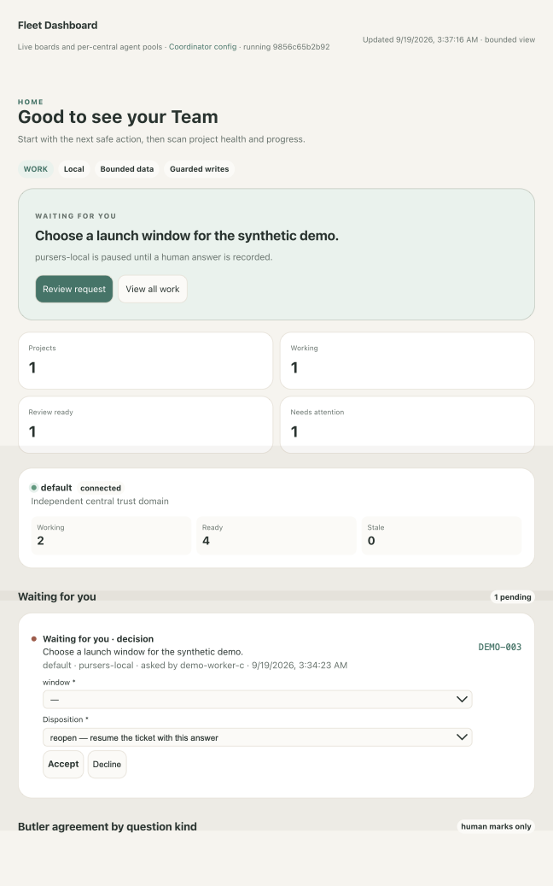
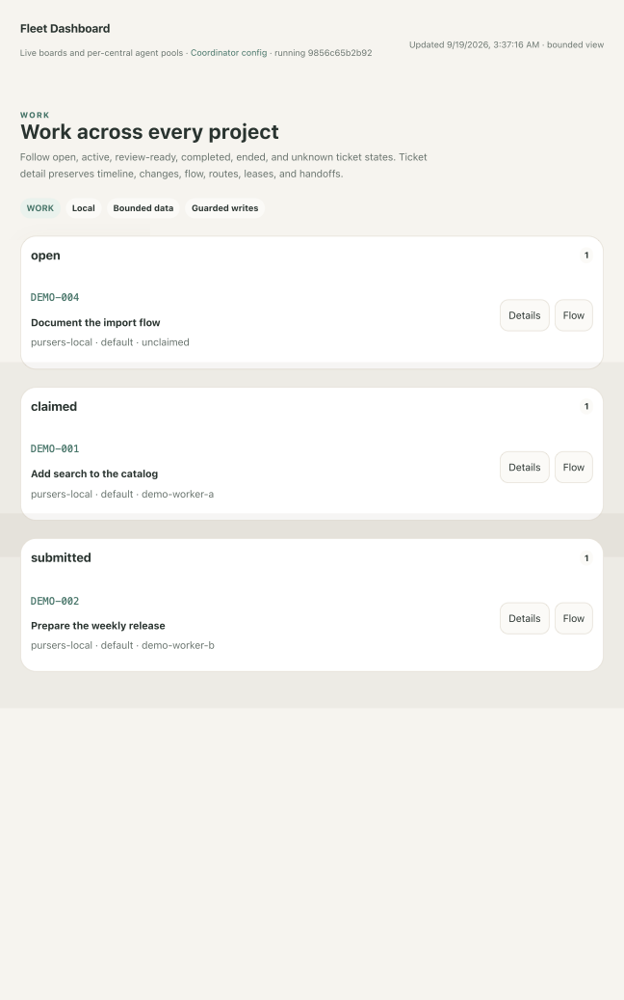
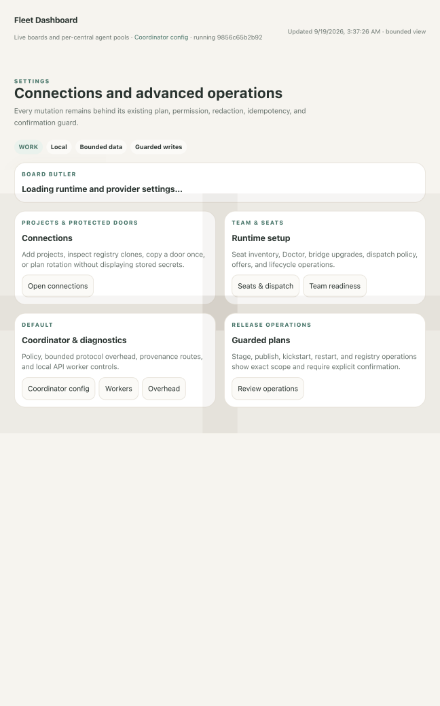
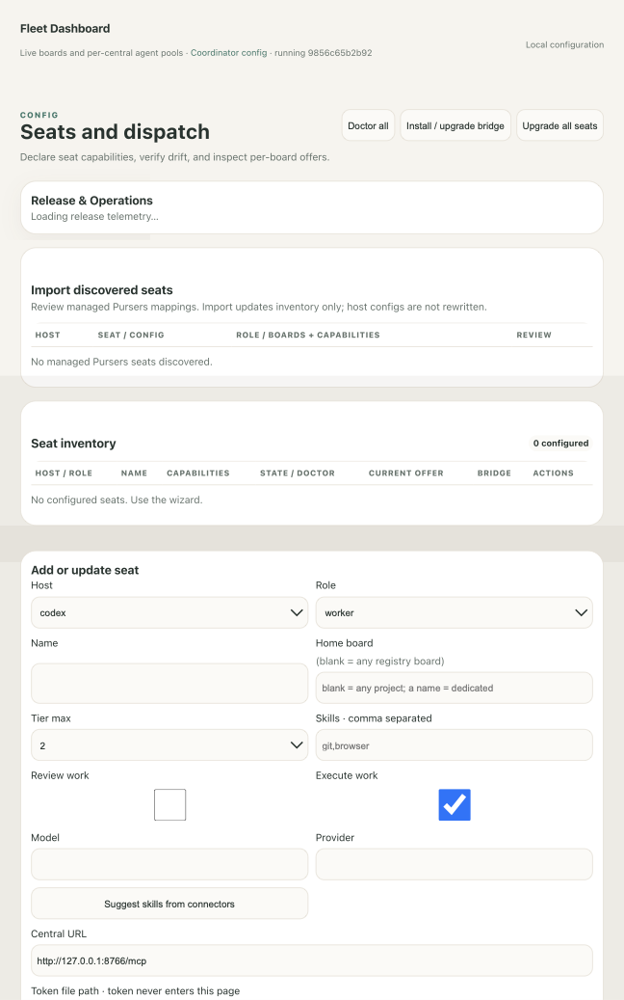
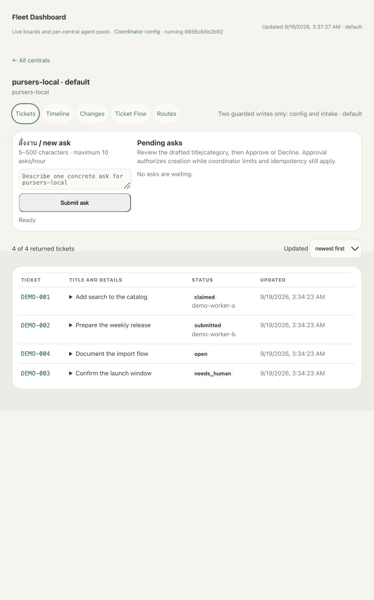

# Fleet Dashboard and Board Butler

This guide is for an operator starting with a fresh `pip install pursers` and
`pursers-central init`. It explains how to run the repository-owned Fleet
Dashboard, use every page, configure seats without exposing credentials, and
operate Board Butler. Replace every `/PATH/TO/...` value with an operator-owned
path. Never paste a bearer token into a command, browser form, ticket, or log.

The dashboard and Butler are source-invoked operator tools, not installed
console commands. Keep a dedicated, clean Pursers clone for them. The Central
and Client packages can still be installed from PyPI for normal use; the
editable installs below deliberately keep these two services aligned with the
selected dashboard checkout.

## Install and start

Choose unused loopback ports. This guide uses `18767` for Central and `18899`
for the dashboard; it intentionally does not use the repository defaults.

```bash
python3 -m pip install pursers
pursers-central init /PATH/TO/private/central --port 18767
/PATH/TO/private/central/run-central.sh
```

Keep the generated admin token file private. In another terminal, from the
dedicated Pursers clone:

```bash
uv venv /PATH/TO/private/fleet-dashboard-venv
uv pip install \
  --python /PATH/TO/private/fleet-dashboard-venv/bin/python \
  -e /PATH/TO/Pursers/packages/client \
  -e /PATH/TO/Pursers/packages/central

export PURSERS_FLEET_PYTHON=/PATH/TO/private/fleet-dashboard-venv/bin/python
export PURSERS_FLEET_REPO=/PATH/TO/Pursers
export PURSERS_FLEET_RUNTIME_DIR=/PATH/TO/private/fleet-dashboard-runtime
export PURSERS_FLEET_STATE_DIR=/PATH/TO/private/fleet-dashboard-state
export PURSERS_BUTLER_STATE_DIR=/PATH/TO/private/board-butler-state
export PURSERS_BUTLER_ENTRYPOINT=/PATH/TO/ButlerPursers/tools/board-butler/board_butler.py
export PURSERS_BUTLER_PROVIDER_SECRETS_DIR=/PATH/TO/private/board-butler-provider-secrets
export PURSERS_FLEET_URL=http://127.0.0.1:18767/mcp
export PURSERS_FLEET_TOKEN_PATH=/PATH/TO/private/central/admin.jwt
export PURSERS_FLEET_HOME_BOARD=example-board
export PURSERS_FLEET_PORT=18899
/PATH/TO/Pursers/tools/fleet-dashboard/launch.sh
```

Open `http://127.0.0.1:18899`. The launcher binds only to loopback, puts its
temporary files and bytecode outside the clone, and refuses runtime or state
directories inside the clone. Prefer `PURSERS_FLEET_TOKEN_PATH`; the dashboard
uses the token file but does not return the token to the browser or log it.
The three `PURSERS_BUTLER_*` paths are the shared deployment contract with the
resident. They may name a separate exact-tag Butler checkout and state root;
the state and provider-secret values must exactly match the Butler service.

To enable the **Doors** panel, add these paths before starting the dashboard,
and point Central at the same public JWKS file:

```bash
export PURSERS_FLEET_DOORS_KEYS_DIR=/PATH/TO/private/door-keys
export PURSERS_FLEET_JWKS_PATH=/PATH/TO/private/jwks.json
export CENTRAL_JWKS_PATH=/PATH/TO/private/jwks.json
```

The key directory is private; the JWKS contains public verification keys.

### macOS LaunchAgent example

Use the checked-in template rather than inventing a second service command:

```bash
cp /PATH/TO/Pursers/tools/fleet-dashboard/com.pursers.fleet-dashboard.plist.template \
  /PATH/TO/Library/LaunchAgents/com.pursers.fleet-dashboard.plist
```

In the private copy, replace every `/PATH/TO/...` placeholder and set the
single-Central URL, admin token-file path, home board, and the optional port and
Door paths. Keep the runtime, state, token, and log locations outside the clone.
Then validate and load it:

```bash
plutil -lint /PATH/TO/Library/LaunchAgents/com.pursers.fleet-dashboard.plist
chmod 600 /PATH/TO/Library/LaunchAgents/com.pursers.fleet-dashboard.plist
launchctl bootstrap "gui/$(id -u)" \
  /PATH/TO/Library/LaunchAgents/com.pursers.fleet-dashboard.plist
launchctl print "gui/$(id -u)/com.pursers.fleet-dashboard"
```

The template's `ProgramArguments` call `tools/fleet-dashboard/launch.sh`; its
environment names the interpreter, clone, external runtime/state paths, the
exact Butler entrypoint, the shared Butler state and provider-secret paths,
Central URL, token file, and home board. For multiple Centrals, use a private
`PURSERS_FLEET_CENTRALS` JSON file and remove the single-Central URL, token, and
home-board entries.

**Not verified on this release:** the template passed `plutil -lint`, but this
guide's throwaway run did not bootstrap a persistent LaunchAgent. Loading a
user service would have modified operator launchd state outside the throwaway.

### Upgrade and verify the deployed revision

Upgrade only a clean, dedicated clone to a reviewed 40-character commit that
is in `origin/main`:

```bash
PURSERS_FLEET_REPO=/PATH/TO/Pursers \
PURSERS_FLEET_STATE_DIR=/PATH/TO/private/fleet-dashboard-state \
PURSERS_FLEET_PYTHON=/PATH/TO/private/fleet-dashboard-venv/bin/python \
  /PATH/TO/Pursers/tools/fleet-dashboard/upgrade.sh \
  0123456789abcdef0123456789abcdef01234567

curl --fail --silent http://127.0.0.1:18899/api/version
git -C /PATH/TO/Pursers ls-remote origin refs/heads/main
```

`upgrade.sh` fetches `origin/main`, rejects a dirty clone or unrelated SHA,
reinstalls changed package manifests, probes imports, and restarts the loaded
LaunchAgent. It restores the previous checkout if setup or restart fails. The
version endpoint returns `running_sha` and `dirty`; the page header shows the
first 12 characters. The prior full SHA is saved under the external state
directory and can be supplied to the same command for rollback while it remains
in `origin/main` history.

**Not verified on this release:** the throwaway dashboard was started directly
through `launch.sh`; `upgrade.sh` was not executed because it requires and
restarts an already loaded persistent LaunchAgent.

## Read the dashboard

The global search filters visible data. The theme, density, and keyboard-help
controls are local browser preferences. A synthetic four-ticket board looks
like this:

**Light theme** / **Dark theme** and **Compact density** / **Comfortable
density** change only local presentation. **?** opens the keyboard reference;
**Close**, Escape, or **?** closes it. Search results are navigation links and
do not mutate data. While a form has focus or unsaved input, the five-second
refresh pauses; **Resume** discards the local dirty marker, removes focus, and
allows refresh again without submitting the form.



### Home

Home is the triage surface across all configured Centrals. Health cards show
online, busy, ready, and stale seats plus ticket totals. **Waiting for you**
contains unresolved human requests and held Butler drafts. **Needs attention**
surfaces findings, old open work, lapsed leases, failed dispatch, context
pressure, and unavailable push subscriptions.

For a human request, complete only the requested safe fields, choose a
disposition, then select **Accept** or **Decline**:

- **reopen** resumes the ticket with the answer;
- **park** records the answer while leaving the ticket waiting;
- **cancel** ends the ticket.

A request involving credentials is not rendered as a browser form. Trusted
external hand-offs open only after an explicit click. For an attention row,
**Acknowledge** hides that exact fingerprint until it changes; **Snooze 24h**
hides it for one day. These controls change the dashboard's private attention
state, not the ticket lifecycle.

A held Butler draft also offers quality-mark buttons. **Would send as is**,
**Needed edits**, **Wrong**, and **Should have escalated** score a produced
draft; **Correct escalation** and **Should have answered** score an escalation.
They record a human evaluation in Central and refresh the agreement summaries;
they do not send the draft, answer the question, or release the hold.

### Projects

Projects lists the active registry boards and their visible ticket counts.
**Workspace** opens the board. Shortcut buttons open **Ticket Flow**,
**Timeline**, **Changes**, and **Routes**. A bounded or truncated snapshot is
labelled; missing rows are never inferred.

### Work

Work groups current work into waiting/open, working, review, and recently done
states. Use **Details** for the ticket record or **Flow** for its lane. Rejected
submissions are called out instead of being blended into ordinary review work.



### Team

Team shows the shared pool by role and live state, including active tickets,
lease timing, capabilities, models, and clients. Filters narrow by role, state,
board, or client. Operator controls can test, start, stop, or restart a
configured seat and open its bounded logs. **New agent** and **Copy seat
command** lead into the configuration workflow; retired and stale seats remain
visibly distinct from available ones.

The controls have these effects:

- **Test** checks the configured local worker without changing its running
  state. **Start**, **Stop**, and **Restart** control that one managed worker;
  disabled buttons show actions that do not match its current state. The
  action status appears above the Team list, and failures stay visible there.
- **Log tail** expands the last 20 bounded lines for that worker. It does not
  start a live stream or expose the worker's credential file.
- **Copy seat command** copies the one-time local provisioning command when
  the seat files do not exist. **New agent** opens the two-step provisioning
  card; **Start** remains disabled until the seat is detected. In the New API
  agent dialog, **Save and continue** validates the provider settings, stores
  the API key in Keychain rather than the local config, and opens the
  provisioning step. The × button closes the dialog without saving.
- **Retire** marks one stale identity retired after Central authorizes the
  request. **Retire inert** applies Central's guarded cleanup to eligible
  inactive identities on that board. The refreshed retired/inactive drawer is
  the result surface. There is no **Resume** button in this release: the same
  identity resumes by calling `board_join` or `board_onboard`, after which the
  next Fleet refresh moves it back into the active pool.
- The role/state/board/client filters, **Reset**, and the stale-agent visibility
  toggle only change the browser view; they do not modify Central.

### Approvals

Approvals collects human requests, submitted tickets waiting for review, and
intake decisions. Open the linked ticket or board before acting. Human-request
resolution is performed on Home; intake accept/decline is performed in the
board workspace. Review submission remains a reviewer action, not a dashboard
shortcut.

### Activity

Activity is a bounded recent-change feed across boards. Ticket, Timeline, and
Changes links preserve the relevant board context. Counts describe only the
returned event window; use the board's sequence filter when investigating an
exact transition.

### Settings

Settings contains service and operator controls:

- **Board Butler** shows configuration, running mode, last activity, and the
  immediate stop control.
- **Connections** shows Central and dashboard connectivity.
- **Team seats and dispatch** links to Config.
- **Coordinator**, **workers**, and **overhead** expose bounded operational
  state and thresholds.
- **Release operations** display version and release evidence and require an
  explicit server-generated confirmation plan before a guarded action.



Release, stage, kickstart, and restart controls are operator actions. A worker
must not use them unless a ticket explicitly authorizes that operation.

In the Board Butler card, **Validate & save** sends one bounded validation
request to the configured provider, then atomically writes the non-secret
settings and any supplied API key to the private `0600` credential file. It
does not start Butler or switch it to active mode. The message directly below
the button reports validation or save failure; on success the refreshed card
shows the saved endpoint, model, key-present state, and runtime state. An
existing key is preserved when the key field is left blank. **Stop butler now**
is enabled only for a verified live process; it engages the private kill switch
and reports the stopped state on the refreshed card.

The draft protocol is explicit. Existing configurations keep **Pursers JSON
v1** and their existing draft path. For a standard OpenAI-compatible or LiteLLM
endpoint ending in `/v1`, select **OpenAI chat completions v1** and use
`chat/completions` as the draft path. Fleet validates the selected protocol and
relative path; it does not infer or silently rewrite either value.

The linked **Coordinator config** page exposes the published thresholds and
intake policy. **Save config** uses the displayed revision for concurrency and
shows success or conflict beside the button; mode changes still require a
service restart. **Workers** lists local API workers: **Test**, **Start**, and
**Stop** act on one worker, **Copy seat command** copies missing-seat
provisioning, and **Save worker** stores its key in Keychain. An existing worker
must be stopped before it can be overwritten. **Overhead** and its expandable
bridge diagnostics are read-only.

Config's release card has four separately guarded buttons. **Publish from tag**,
**Stage Central**, **Kickstart Central**, and **Restart dashboard** first fetch
an immutable server-generated plan and show its exact command and digest in a
confirmation dialog. Cancel leaves state unchanged. Confirm queues the plan;
the output pane then shows the job ID, bounded logs, terminal outcome, and
reported effect. These controls require operator authority and are outside an
ordinary worker task.

### Config

Config is the write-oriented setup page. It inventories seats, bridge versions,
Doctor results, registry coverage, dispatch policy, projects, release state,
and Door credentials. Plan/apply operations are loopback and same-origin only,
use atomic writes and timestamped backups, and append scrubbed audit records.



## Work inside a board

Open a project, then use its five tabs:

- **Tickets** shows bounded ticket records, details, required submission fields,
  current findings, review state, and ticket activity.
- **Timeline** groups returned journal events by day and ticket.
- **Changes** summarizes created, claimed, submitted, closed, and rejected
  events in the last 24 hours or after an entered sequence number.
- **Ticket Flow** places tickets into Open, Working, Review, and Done lanes.
- **Routes** traces who created, executed, submitted, and reviewed each ticket,
  with rework counts and per-seat load for the returned window.



The board header warns when a snapshot is truncated. Timeline, Changes, Flow,
and Routes do not extrapolate beyond the displayed bounds.

At the top of the Tickets view, **Submit ask** adds the 5–500 character request
to the board's bounded coordinator-intake queue; the form reports the queued
ask ID or the rejection. It does not create a ticket immediately. When the
coordinator supplies a draft title and category, **Approve** authorizes guarded,
idempotent ticket creation with the displayed title, while **Decline** removes
the ask from the active queue and records the decision. Both decisions use the
displayed queue revision, so a concurrent change fails instead of overwriting
it. Their result appears in **Pending asks** after refresh. The ticket
**Details** disclosure and links to Timeline, Changes, Flow, and Routes are
read-only navigation. **Copy memory ID** copies the latest handoff's identifier
without changing it. On Changes, **Apply** only recalculates the bounded view
after the entered sequence number; it does not acknowledge or alter events.

## Common operator tasks

### Add a project

1. Configure the dashboard Door key directory and public JWKS path, and give
   Central the same JWKS path.
2. In Config, enter a unique project name, board ID, absolute operator checkout,
   and integration ref.
3. Select **Add project** and inspect each ordered result: registry entry, board,
   worker/reviewer Door principals, policy defaults, and clean fleet clone.
4. **Copy door string** issues or retrieves each role Door and places the
   one-time value on the local clipboard. The result panel shows only its
   non-secret key ID and success or failure; the dashboard does not persist or
   list the Door.
5. Stop before joining a remote seat unless your environment already provides
   an approved secret-file hand-off. The shipped `pursers-door join` command in
   this release accepts the Door only as a positional command-line argument;
   it has no file or standard-input option. A Door contains a bearer
   credential, so putting it in process arguments violates this guide's
   file-based-credential rule.

**Not verified on this release:** there is no shipped file-based or dashboard
join workflow for a new Door. Issuing and rotating Doors in the loopback UI was
verified, but completing `pursers-door join` was deliberately not prescribed
or run. Use an existing administrator-provisioned token file with the seat
wizard, or wait for a file/stdin Door import before onboarding through a Door.

Re-running the same project is idempotent. The endpoint requires the dashboard
principal to be a board administrator and does not touch key material until
that authorization is proven.

### Add or update a seat

1. In Config, choose the host and role, then enter the seat identity,
   capabilities, model/provider, Central URL, token-file path, optional CA path,
   bridge command, and host config path. Token contents never enter the page.
2. Select **Preview exact changes**. Read the redacted diff and confirm the
   role-derived capabilities: workers work, reviewers review, and coordinator
   or orchestrator seats do neither by default.
3. Select **Confirm and apply** only when the diff is correct. The adapter backs
   up existing files before atomic replacement.
4. If the result says **NEEDS RESTART**, restart that host, then run **Doctor**.

Use **Import discovered seats** only after reviewing host/seat/connector/role
mappings and conflicts. Import adds conflict-free inventory rows and runs
Doctor; it does not rewrite discovered host configs.

Host configuration layouts evolve. The wizard owns the generated managed
blocks; do not copy a stale JSON/TOML example from another host. These official
host references were checked on 2026-09-19:

- [Codex MCP configuration](https://developers.openai.com/en-US/docs/extend/mcp)
- [Claude Code MCP](https://docs.anthropic.com/en/docs/claude-code/mcp)
- [Claude Desktop MCP](https://docs.anthropic.com/en/docs/mcp)
- [Cursor MCP](https://docs.cursor.com/context/model-context-protocol)
- [Goose extensions](https://block.github.io/goose/)
- [Zed MCP](https://zed.dev/docs/ai/mcp)

### Run Doctor and upgrade the bridge

Use **Doctor** on one row or **Doctor all** after configuration or a host
restart. It checks managed config drift, host timeout, token/CA paths, bridge
version, identity fingerprint, clean-clone freshness, registry visibility, and
a five-second push subscription. `poll` is an explicit warning/fallback, not a
healthy push result. **Fix** applies supported repairs; review its output.

**Install / upgrade bridge** updates the persistent bridge tool. **Upgrade all
seats** updates managed seat configurations; **Upgrade bridge** operates from a
single row. Jobs expose an ID and update once per second. Restart a host when
the completed result requests it, then rerun Doctor. Goose rows also provide
**Regenerate Goose** for their managed configuration.

For headless diagnosis from the clone:

```bash
python3 tools/fleet-dashboard/seat_config.py doctor --json
python3 tools/fleet-dashboard/seat_config.py doctor --fix --json
```

Doctor redacts token contents. Its configuration references token files and a
fingerprint; it never requires a raw bearer token in host configuration.

The remaining Config controls are guarded as follows:

- **Suggest skills from connectors** proposes capability labels in the form; it
  changes no file. **Preview exact changes** validates paths and renders a
  redacted plan. **Confirm and apply** becomes available only for that plan,
  creates timestamped backups, writes atomically, and reports either completion
  or **NEEDS RESTART** above the inventory. **Copy session prompt** copies the
  generated non-secret restart prompt from that result.
- **Use in wizard** loads a discovered host config into the form without
  writing it. **Import and run Doctor** imports only the reviewed,
  conflict-free inventory mappings, leaves host configs untouched, and starts
  Doctor; the import count and job result appear above the inventory.
- **Doctor** checks one row; **Doctor all** checks every configured row. **Fix**
  applies only repairs declared safe by Doctor. Results appear in the Doctor
  panel and the affected inventory row.
- **Install / upgrade bridge** updates the persistent bridge executable.
  **Upgrade bridge** targets one row, and **Upgrade all seats** rewrites every
  managed seat configuration to the installed bridge. **Regenerate Goose** is
  limited to that host's managed Goose configuration. Each job shows progress,
  completion, and any restart prompt above the inventory.

Each board's **Save policy** writes the displayed claim TTL, offer TTL,
broadcast re-offer delay, second-opinion switch, and fallback-broadcast switch
through the board-admin-authorized endpoint. Invalid bounds are rejected; a
successful write says **Policy saved** and refreshes the offers, unassignable
work, dispatch history, and recent timeline beneath the form. In **Registry
work trees**, **Create fleet clone** creates the fleet-owned clone when absent;
**Fetch and detach origin/main** refreshes an existing clean clone. The button
refuses unsafe or conflicting Git state, and its success or failure appears at
the top of Config. Neither action makes the operator checkout writable to
seats.

### Issue, rotate, and revoke Doors

In Config, **Copy door string** issues or fetches a role Door and returns it once
over loopback with `Cache-Control: no-store`. **Rotate** creates a new signing
key version, publishes its public key, revokes the previous key ID, and returns
the replacement Door string. Seats using the prior string must join again.
Both actions require the dashboard's configured key directory and Central
JWKS path; their scrubbed result appears in the Doors panel. There is no
**Revoke** button in this release; revocation uses the headless key-ID command
below. Do not paste a copied or rotated Door into a shell argument: this release
has no compliant file/stdin join path, as noted under **Add a project**.

For an explicit headless revocation, use only the visible non-secret `kid` from
the inventory:

```bash
python3 tools/wait-bridge/door_admin.py revoke-kid \
  door-example-worker-v2 --jwks /PATH/TO/private/jwks.json
```

Revocation invalidates all Door credentials signed by that key version. It does
not reveal or delete bearer tokens already issued through another principal.

## Refresh, cache, and connection behavior

Fleet and the open board detail refresh every five seconds. The server also
caches its Central snapshot for up to five seconds, so two quick reads may show
the same generation. Long Config jobs have their own one-second progress poll.

When a refresh fails, the last successful snapshot remains visible and a
connection banner reports the affected source, last success, error class, and
recovery hint. Treat the banner as stale-data disclosure, not proof that the
displayed state is current. The browser uses no-store requests; pressing reload
does not turn an old server snapshot into new Central evidence.

## Board Butler

Board Butler is one resident coordinator seat. For every active registry board
it refreshes the real coordinator derivation and drafts evidence-backed answers
to mechanically checkable questions. It is not a general autonomous
coordinator, worker, reviewer, release bot, or source of invented evidence.

It always escalates scope changes, gate waivers, releases, membership changes,
registry changes, and unknown or incomplete evidence. It never answers a
coordinator question directly; questions remain human-reviewed drafts.

### Shadow mode

Shadow is the launcher and LaunchAgent default. It refreshes findings, produces
drafts and durable holds, and performs no ticket action. Validate one cycle
before installing the service:

```bash
PYTHONPATH=/PATH/TO/Pursers/packages/client/src \
python3 /PATH/TO/Pursers/tools/board-butler/board_butler.py \
  --url http://127.0.0.1:18767/mcp \
  --token-path /PATH/TO/private/board-butler.jwt \
  --home-board example-board \
  --agent-name board-butler-local \
  --repo /PATH/TO/Pursers \
  --pid-file /PATH/TO/private/board-butler-state/board-butler.pid \
  --cursor-file /PATH/TO/private/board-butler-state/cursor.json \
  --runtime-status-file /PATH/TO/private/board-butler-state/runtime.json \
  --local-kill-file /PATH/TO/private/board-butler-state/KILLED \
  --provider-secrets-dir /PATH/TO/private/board-butler-provider-secrets \
  --refresh-seconds 60 --once --dry-run
```

Give Butler a distinct coordinator credential and private state path; never
reuse a worker or reviewer token. Install its checked-in LaunchAgent template
the same way as the dashboard template, leave
`PURSERS_BUTLER_RUNTIME_MODE=shadow`, validate with `plutil -lint`, and bootstrap
it with `launchctl`. Set `PURSERS_BUTLER_PROVIDER_SECRETS_DIR` to the exact same
directory configured for Fleet. Fleet verifies the private pidfile lock, the
non-zombie PID, the exact Butler entrypoint, and every state/provider path in
the resident command before it reports running or sends `SIGTERM`. A resident
that publishes a running heartbeat but does not match that contract produces
the bounded `process_contract_mismatch` startup diagnostic; no private path or
credential is included. The repository does not install or start it
automatically.

### Active mode and its limits

Active mode adds exactly two mechanical ticket actions, and only for boards
explicitly named by `--act-on-board`:

1. park an open ticket after repeated `no_live_candidates` cycles when no live
   seat advertises `can_work=true`;
2. record refusal of a proposed escalation target whose identity cannot work.

Create the separate, owner-only authorization file first:

```bash
python3 /PATH/TO/Pursers/tools/board-butler/authorize_active.py \
  --output /PATH/TO/private/board-butler-state/active-authorized.json \
  --confirm ENABLE-BOARD-BUTLER-ACTIVE
chmod 600 /PATH/TO/private/board-butler-state/active-authorized.json
```

Then stage and review a plist with active mode, its authorization path, and at
least one explicit acting board before reloading the service. Changing only the
mode string cannot activate Butler. Repeat `--active-action` to narrow the two
allowed classes; it cannot add new autonomous classes. Each proposed action is
written to `coordinator_findings`, shown under **Waiting for you**, and held for
the configured interval so an operator can veto it.

### Stop, veto, resume, and inspect

**Settings → Stop butler now** writes a private `KILLED` marker before sending
`SIGTERM`. The LaunchAgent then exits cleanly and stays stopped. A Central write
already accepted remains atomic; an interrupted question is replayed because
its cursor was not advanced.

To veto one held action, run the documented `board_butler.py` command with all
normal connection arguments plus:

```bash
--veto-question CQ-example --control-reason "evidence is stale"
```

To resume safely, return the staged configuration to shadow mode unless active
operation is deliberately re-authorized, then:

```bash
rm /PATH/TO/private/board-butler-state/KILLED
launchctl kickstart "gui/$(id -u)/com.pursers.board-butler"
```

Decisions, findings, holds, vetoes, and human quality marks are durable Central
board state and appear in Fleet. The local private `runtime.json` records only
PID, mode, start time, and last activity; `cursor.json` preserves the positive
journal cursor. Process output goes to the private LaunchAgent log paths.
Settings reports **Not configured**, **Configured · not running**, **Running ·
shadow**, or **Running · active** only after it verifies the singleton pidfile
and live process. A stale runtime file is not treated as a running Butler.

**Not verified on this release:** the Butler plist passed `plutil -lint`, but
the throwaway did not install a resident Butler, authorize active mode, execute
an autonomous action, or engage its kill switch. Those steps intentionally
change persistent service or board state and require an operator-owned Butler
credential.

## Safe troubleshooting

- If startup fails, verify that Central `/healthz` succeeds, the dashboard token
  file contains exactly one bearer token, and all service paths are absolute.
- If data is stale, read the connection banner before restarting anything.
  Confirm Central independently, then wait for the next five-second refresh.
- If Doctor reports split identity, regenerate that seat from the same private
  token file, restart its host, and rerun Doctor.
- If `upgrade.sh` refuses, keep the safety condition: clean the dedicated clone
  deliberately or choose a different clean clone; do not bypass the check.
- If a Door action is unavailable, configure both dashboard key/JWKS paths and
  Central's public JWKS path, then restart the respective services.
- Keep the dashboard loopback-only. If an operator adds a reverse proxy, the
  proxy and access policy remain operator-owned and must preserve the stable
  loopback port and same-origin protections.
