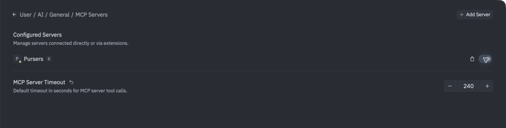
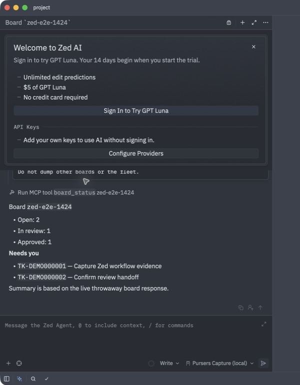
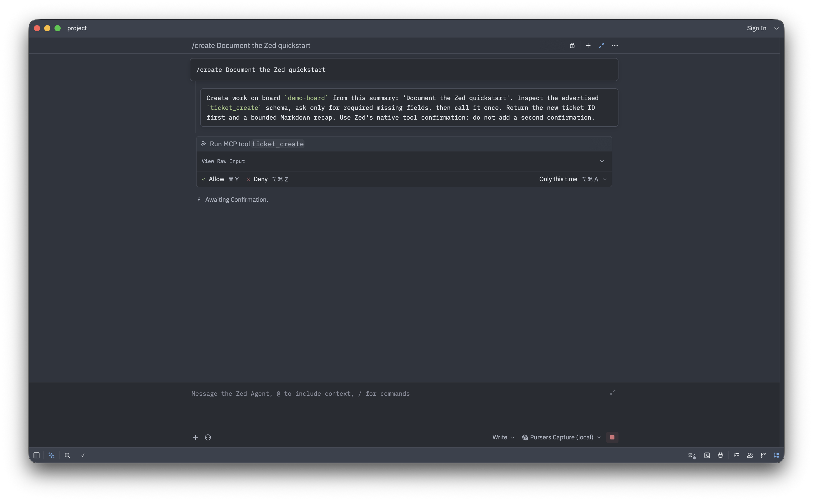
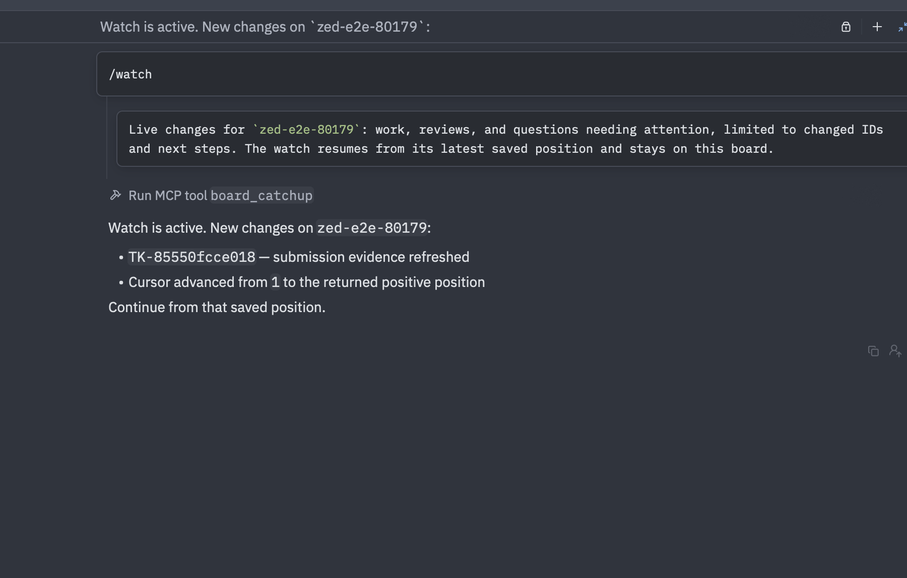
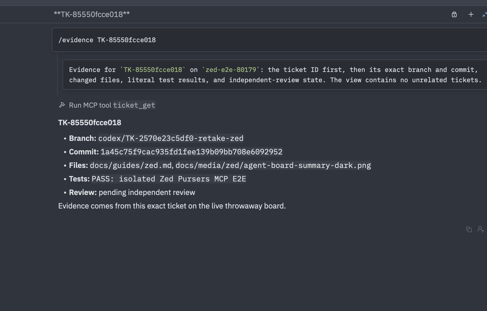

# Use Pursers from Zed

The Pursers extension connects Zed's Agent Panel to one Pursers board. You can
check the board, create work, watch for changes, inspect delivery evidence, and
answer a seat's question without putting a bearer token in Zed settings. The
extension starts a local `pursers-mcp` relay, which reads the credential from a
token file and talks to Pursers Central.

New to Pursers? Start with [your first finished ticket in Zed](zed-first-ticket.md).
It is a ten-minute narrative walkthrough; this page is the complete reference.

## Commands

| Command | Result |
| --- | --- |
| `/setup` | Check the local prerequisites, ask before making changes, then create and start a local Central and board in this chat. |
| `/board` | Show a compact board summary and the items that need you. |
| `/create <summary>` | Create one ticket after Zed shows its normal tool permission prompt. |
| `/watch` | Watch this board until an important update arrives; a seat question ends the turn so Zed can notify you. |
| `/evidence <ticket-id>` | Show the exact branch, commit, changed files, tests, and review state for one ticket. |
| `/answer <ticket-id> <answer>` | Answer a pending human request after Zed shows its permission prompt. In an ACP thread, use `/answer` or `/answer #N` to open a form for a watched seat question; `#N` is needed only when several are pending. |

These are MCP prompts. If another server defines the same prompt name, Zed may
prefix the command with the server ID, for example `/pursers.board`.

## First run

You do not need to start Central, create a board, or find a token path before
opening Zed. The extension supplies its Python runtime. With the local defaults,
the relay starts with two setup tools even when Central is not running.

## Install the extension

The extension is not listed in Zed Extensions yet. Install it from a Pursers
checkout for now:

1. Open the Zed Command Palette.
2. Run **zed: install dev extension**.
3. Select `integrations/zed/pursers-mcp` in the checkout.

After the extension is listed, open Zed Extensions, search for **Pursers**, and
select **Install** instead.

> [!WARNING]
> Uninstalling the extension empties `context_servers` without warning. Copy
> your Pursers entry from `settings.json` before uninstalling; Zed cannot restore
> it from the UI.

## Configure the connection

Open Zed Extensions, find **Pursers**, and select **Configure**. Use this modal
for the first setup only. Once the connection works, keep the configuration in
`settings.json`: saving the modal replaces the whole Pursers entry with the text
currently in its box, so omitted keys are deleted. Every fresh open starts from
the shipped example; it does not load the values already saved in
`settings.json`. Values you type remain visible only in that open dialog, until
you save or cancel it.

| Setting | Required | Value |
| --- | --- | --- |
| `central_url` | Yes | The Central MCP endpoint, such as `http://127.0.0.1:8766/mcp`. |
| `board_id` | Yes | The board to use. The local Quickstart default is `pursers-local`. |
| `token_file` | No | A worker JWT path for a Central you already run. Omit it for `~/.pursers/central/worker.jwt`. Store the path, not the token. |
| `ca_file` | No | A CA certificate file when Central uses a private TLS certificate. |
| `uvx_path` | No | An absolute path to `uvx`, such as `/opt/homebrew/bin/uvx`, when Zed cannot launch the automatically resolved executable. |
| `package_spec` | No | A different `pursers-client` version or a local client checkout for development. |

The default form is:

```json
{
  "central_url": "http://127.0.0.1:8766/mcp",
  "board_id": "pursers-local"
}
```

Save the modal and open the Agent Panel. Run `/setup`; Pursers first reports
what is missing, then asks whether it may create `~/.pursers/central`, keep
Central running in the background, and create the configured board. Declining
or cancelling makes no changes. After you accept, Zed receives
`notifications/tools/list_changed` and the board tools appear in the same chat.
The setup result names `~/.pursers/central/central.log` for troubleshooting.

If Central is already running but the configured board is not readable, the
same setup tools remain available. After confirmation, `/setup` uses the local
admin credential to create or join the board and onboard the configured local
principal; it does not start a second Central. `board_onboard` is intentionally
not exposed as a general Zed tool: the consent-gated setup action is narrower
and does not hand normal chats an identity-management primitive.

With the managed local token, Pursers also supplies the setup identity behind
the scenes. The first `/create` therefore works without asking you to discover
or enter an `agent_name`.

Save the modal once. In **Settings → AI → MCP Servers**, confirm that Pursers
has a green state dot. Open the Agent Panel and run `/board`. A successful
response starts with the configured board ID and shows a compact status
summary. After that, edit the Pursers object in `settings.json` instead of
reopening and saving the modal.





### Restricted Mode

Zed opens a project it has not seen before in Restricted Mode, and that blocks
every MCP server from starting. Pursers then shows no state dot and its commands
are missing, with nothing in the server log to explain why. Click **Trust and
Continue** in the banner at the top of the workspace, once per project, and the
server starts.

## Daily loop

Keep one Agent Panel thread for the board:

1. Run `/board` to see what needs attention.
2. Run `/create <summary>` when you want to add work. Review Zed's native tool
   permission prompt before allowing the write.

   

3. Run `/watch` while claims, reviews, or questions matter. Keep that turn
   active. The first new seat question, review verdict, or failure ends the
   turn after its update so Zed's normal completion notification can wake you;
   run `/watch` again when you want the next important update.

   
4. Run `/evidence TK-…` before acting on a submission. Check the exact commit,
   file list, test output, and independent-review state.

   

5. Merge only through your normal, explicitly authorized repository workflow.
   The extension does not add a merge button.

### When a seat asks you a question

Questions reach you in Zed only while `/watch` is active and the Personal
profile selects a coordinator identity registered to at least one project on
the board. In that case, each new seat question appears as a clearly marked
update with the seat name, ticket ID, question, waiting time, and a short `#N`
reference. The agent then completes that watch turn; Zed does not notify for a
free-standing `session/update`, but it does apply its normal completion
notification when the turn stops. Run this to open the answer form without
retyping the ticket ID:

```text
/answer
```

If several questions have accumulated, select one explicitly; Pursers never
guesses:

```text
/answer #2
```

The session-scoped `elicitation/create` form shows the question and fields for
the ticket's required evidence. Accepting the form proceeds to a separate
`allow_once` permission request for the board write. Declining or cancelling
the form, rejecting permission, or closing the thread leaves the question
unanswered on the board.

The update can reach a loaded ACP thread for the lifetime of its connection,
but Zed drops it after the thread entity is released. There is no delivery or
notification when Zed is closed entirely, and no background watcher remains
after the watch turn ends. Questions raised while `/watch` is stopped appear
only after `/watch` runs again; its initial read checks the coordinator's
current open-question inbox rather than relying on retained journal events.
That inbox read is bounded to the oldest 100 open questions. If the selected
identity is a worker or is not registered as a project coordinator, `/watch`
states that seat-question replies are unavailable and continues streaming
ordinary board updates; it does not widen that identity's authority. The MCP
extension still has no push channel that can wake the Agent Panel; use a
correctly registered coordinator ACP thread for these same-thread replies, or
check the board elsewhere.

## Optional: use a Pursers ACP thread

Use `pursers-acp` when you prefer a dedicated Pursers thread in Zed's Agent
Panel. The ACP thread publishes the five board-work commands (everything above
except `/setup`), uses Zed's native
permission prompt for writes, and can show plan state while `/watch` is active.
It uses an existing Pursers Personal profile; it does not use the worker token
from the MCP extension and it is not a coding worker.

The ACP Registry entry is prepared but not listed yet. Until it is listed,
install `pursers-acp` and add the current custom agent configuration to Zed:

```sh
python -m pip install "pursers-acp==0.1.0"
```

```json
{
  "agent_servers": {
    "pursers": {
      "type": "custom",
      "command": "pursers-acp",
      "args": ["--project", "/PATH/TO/PROJECT"],
      "env": {}
    }
  }
}
```

Start a new external-agent thread and select **Pursers**. If the project does
not have a Personal profile, run the documented setup first or launch
`pursers-acp --project /PATH/TO/PROJECT --login` once.

Prefer the MCP extension when you want Pursers tools inside a normal Zed Agent
thread. Prefer the ACP thread when you want a separate board conversation and
native ACP plan updates. Re-run `/watch` after each surfaced question if more
questions must arrive in Zed.

## Troubleshooting

| Problem | Fix |
| --- | --- |
| Pursers stays silent, then Zed logs `ERROR [project::context_server_store] pursers context server failed to start: Context server request timeout` followed by `ERROR [crates/context_server/src/transport/stdio_transport.rs:58] Broken pipe (os error 32)`. | The relay never started; Zed does not report that it could not start `uvx`. Set `uvx_path` to the absolute path printed by `which uvx`, then restart the server. |
| A fresh Configure dialog shows the shipped `pursers-local` example instead of the working values. | This is how the extension dialog opens: it does not hydrate from saved settings. Cancel without saving and edit the Pursers object in `settings.json`. Saving the modal writes its box back verbatim, deleting omitted keys and replacing saved values with the examples shown. |
| The Pursers configuration disappeared after uninstalling the extension. | Uninstalling empties `context_servers`. Restore the entry you copied from `settings.json`; there is no undo in the UI. |
| Setup reports that `uvx` is unavailable. | Let the extension's uv installation finish, then restart the Pursers server. Set `uvx_path` only for a development override. |
| Authentication fails or the token file is rejected. | Confirm that `token_file` points to the correct `worker.jwt`, that the file is readable by your account, and that it contains one credential line. Do not paste the token into the modal. |
| Central is unreachable on the local defaults. | Run `/setup` and accept the confirmation. |
| Central is reachable but the configured board is missing. | Run `/setup` and accept the confirmation. Pursers uses the local `admin.jwt` to create the board and onboard the caller, then refreshes the tools in the same chat. |
| Central says the principal is not a board member. | Run `/setup`. If the local admin credential cannot admit this principal, the result tells a board administrator to run `board_invite_create`, then tells you to redeem it with `board_join` as `zed-local-owner` with role `worker`. |
| Setup says port 8766 is already in use. | Stop the other service, or connect to that Central with its existing `token_file`. Pursers will not start a second process on the port. |
| A private TLS endpoint fails certificate validation. | Set `ca_file` to the private CA certificate file. Do not disable certificate verification. |
| A tool reports a timeout. | Check Central health and retry the bounded command. Keep `/watch` active instead of using an unbounded tool call; the relay caps each wait below Zed's 60-second default. |
| Pursers has no state dot at all and no log output. | The project is in Restricted Mode. Click **Trust and Continue** in the banner at the top of the workspace. |
| A command is missing. | Confirm the Pursers MCP server has a green state dot. Restart it after changing settings. If a prompt name collides, look for the server-prefixed form such as `/pursers.board`. |

Zed 1.20.2 speaks MCP `2025-11-25`. Pursers Central also supports newer MCP
`2026-07-28` features, but Zed does not consume those subscription APIs
directly. The local relay handles the protocol boundary and exposes the
bounded `/watch` workflow instead.
