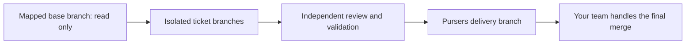

# Deliver reviewed work on a separate branch

Pursers starts from the branch provided in the repository/source mapping, performs
work on isolated ticket branches, and collects approved changes on its own delivery
branch. Your team decides how and when to merge that branch into its environments.
Pursers never automatically completes a PR into the mapped base, development,
release or production branches in this workflow.



## Configure in the dashboard

1. In **Projects**, connect the repository using **Add a project**. Keep the source
   mapping's actual branch; do not assume every repository uses `main` or `dev`.
2. Open **Delivery workflow** (also linked from **Settings**). Select the coordinator
   and repository project. Enter the **Mapped base branch** and **Delivery branch**.
   The default delivery name is `pursers-integration`.
3. Preview the route and branch effects. If the delivery branch is absent, applying
   the plan creates it at the exact observed base SHA. Existing unowned branches,
   ambiguous case/namespace collisions, unavailable access, and active work block
   migration. Nothing is pushed to the base branch.
4. Enable automatic integration only when Butler's connector can provide reliable
   validation for the exact candidate and target. Otherwise ticket PRs remain
   visible for inspection. **Pause integration** stops additional integration while
   your team checks the delivery branch; workers retain isolated ticket branches.
5. Optionally select **Use this workflow as the default for newly onboarded
   repositories**. Each new repository still obtains its own base from its mapping.
   This does not reconfigure existing repositories.
6. Review the impact and confirm once. Plans expire and reject stale registry or
   remote-ref observations. Reload settings to inspect the saved policy.

Branch names are case-sensitive, but namespace collision checks also account for
case-insensitive workstations. Avoid a branch named `pursers` or `Pursers` when
`pursers/<ticket>` branches already exist. No credentials are entered in this form.
Repository credentials remain in the existing protected configuration.

## Configuration contract

A project registry entry can contain:

```json
{
  "integration_ref": "pursers-integration",
  "delivery_workflow": {
    "mode": "integration",
    "base_branch": "release/team-base",
    "integration_branch": "pursers-integration",
    "auto_integrate": false,
    "collection_paused": false
  }
}
```

`integration_ref` is the worker/reviewer base. Butler's PR target comes from the
validated delivery policy. Sonar analysis scope remains in the source mapping;
changing delivery does not silently change analysis branch or reset issue history.
A root registry `delivery_defaults` object supplies the same template for future
auto-onboarding. Its `base_branch` is replaced by each source mapping's branch.
An onboarding source can also declare `delivery_workflow` to override the template.
Projects without a policy retain direct-delivery behavior until explicitly migrated.

## Integration and validation

Workers push only isolated ticket branches. Butler opens their PRs into the delivery
branch after independent approval. Automatic integration processes at most one
candidate per repository board per pass and requires:

- The exact registered repository, approved source SHA and configured delivery target.
- A current target SHA, a mergeable PR and no unresolved negative reviewer votes.
- Successful validation bound to both SHAs and successful required branch policies.
- A durable completion-attempt record written before the upstream mutation.

The connector must declare `ado_pull_request_get`, `ado_repository_details_get`,
`ado_pull_request_checks_get` as read-only, plus policy-gated
`ado_pull_request_update`. Existing PR creation/list tools remain required. The
normalized checks payload consumed by the gate is:

```json
{
  "validation": {
    "source_sha": "<full source commit SHA>",
    "target_sha": "<full delivery-branch SHA>",
    "passed": true
  },
  "policies": [{"enabled": true, "blocking": true, "status": "approved"}]
}
```

This is an adapter contract, **not a claim that every MCP server already emits this
shape**. A raw policy list or a green check from an older target is insufficient.
If the connector does not expose exact validation, automatic integration is blocked.
An upstream checks endpoint error must be corrected or adapted; enabling the toggle
does not bypass it. The gate never substitutes a model's opinion for test evidence.

Source changes require fresh independent review. Target changes require validation
against the new target. A merge attempt with an unknown outcome is reconciled by
reading the PR; it is never blindly repeated. Completion uses `bypassPolicy: false`
and preserves the source branch. No model is called by the integration reconciler.

## Status and handoff

**PR opened** means only that a ticket PR exists. **Awaiting integration** and
**Integration blocked** identify work still waiting for the delivery branch.
**Ready for your team** requires a confirmed completed PR and merge commit into the
configured delivery branch. It does not mean deployed or resolved in Sonar.

Your team creates and completes the final merge using its normal process. Pursers
does not open or complete downstream promotion PRs. Pause integration when a stable
handoff is needed. Resume only when the team is ready for more changes. A source scan
may continue to show issues until the team merges and scans the relevant branch.

## Migration and recovery

Drain active work before changing its route. Existing external PRs retain their
original targets and require a separately reviewed migration; a settings edit never
retargets or completes them. Preserve the source-intake index and ticket evidence.
A branch created before a failed registry CAS is retained for inspection, never
removed automatically. Verify ownership before adopting or removing an orphan.

The native integration reconciler assumes one authorized Butler owns a source index.
Do not start multiple integration writers for the same repository/index. Cross-host
integration arbitration and automatic conflict repair are outside this first native
workflow: conflicts are surfaced for a separately authorized repair with fresh review.
