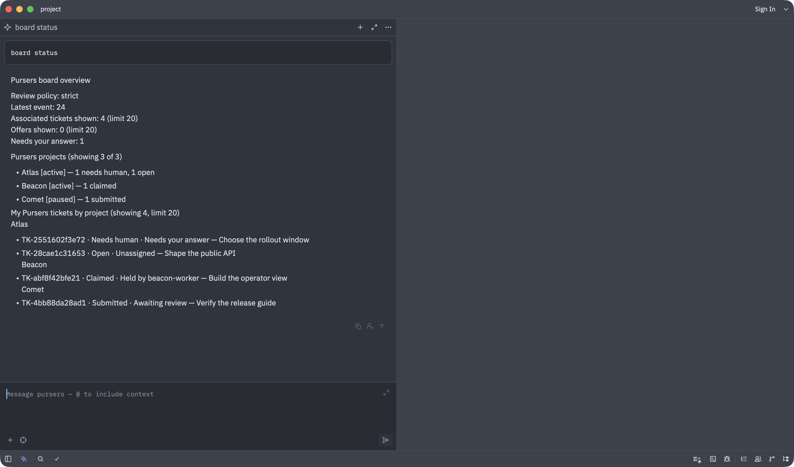
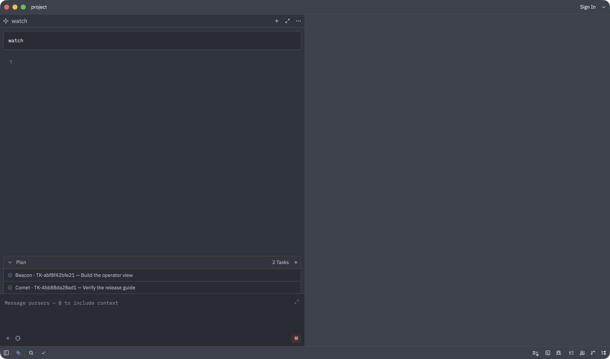

# See a multi-project Pursers board in Zed

Pursers keeps assignment, review, evidence, and project routing on one board.
The Pursers ACP thread makes that board legible without turning Zed into a
second source of truth: `board status` shows the project registry and ticket
states, and `watch` uses one native plan row per in-flight ticket, ordered and
labeled by project, while board events stream into the same thread.



The overview above came from a disposable Personal board with three registered
projects and four tickets. Atlas has open work and a decision waiting for the
human, Beacon has work held by a named seat, and the paused Comet project has a
submission waiting for review. These are product-produced Central states, not
text inserted for the screenshot.

Run `board status` for the durable overview, then `watch` for the live plan.
The watch derives its ticket rows from the existing push subscription, so it
does not depend on a prior command, poll Central, or open another connection to
Central's journal.



## Why this shape

The implementation combines a per-project thread summary with per-ticket plan
entries grouped by project. The summary is best for scanning names, registry
state, ticket state, and ownership together. The plan is best for keeping each
active work or review item visible during the long-running turn. Zed 1.20.2
consumes ACP plan updates and renders their independent rows and statuses in its
native thread UI
([ACP update handling](https://github.com/zed-industries/zed/blob/7c451e694f3c52ee0aeb01d7e28b5fa18cd0ad2f/crates/acp_thread/src/acp_thread.rs#L2586-L2639),
[plan rendering](https://github.com/zed-industries/zed/blob/7c451e694f3c52ee0aeb01d7e28b5fa18cd0ad2f/crates/agent_ui/src/conversation_view/thread_view.rs#L3794-L3854)).

A plan-only design was rejected because Zed collapses the plan and it exists
only during `watch`; it cannot replace the durable board overview. A summary-only
design was rejected because it does not keep individual work and review items
visible as live rows. One ACP session per project was also rejected as the default:
Zed owns thread creation and history, and an external agent session has no ACP
operation that creates sibling threads. Zed does expose external agents in its
Agent Panel and Threads Sidebar, so a human can still create another Pursers
thread when a project needs a separate conversation
([Zed external-agent documentation](https://github.com/zed-industries/zed/blob/7c451e694f3c52ee0aeb01d7e28b5fa18cd0ad2f/docs/src/ai/external-agents.md#L6-L22)).

## Division of labour and handoffs

| Surface | Job | This ticket |
| --- | --- | --- |
| Fleet Dashboard | The fleet-wide operator view: seats, leases, load, health, configuration, history, and whole-system diagnosis. | Unchanged. This ticket does not move or duplicate those controls. |
| Pursers in Zed | The per-developer working surface beside the repository: what needs this human, who holds the nearby work, what evidence is ready, and what changes while they watch. | Adds the bounded project overview and live per-ticket plan grouped by project. |

The two surfaces become more useful together through concrete handoffs:

1. **Shared project names and state vocabulary — in scope here.** The Zed
   overview reads the board's canonical project registry and uses the same
   project names and ticket states that feed the fleet view. No Dashboard code
   changes in this ticket.
2. **Open the fleet-wide picture from a Zed ticket — follow-up.** Pursers ACP
   would need a configured, safe Dashboard URL and a human-readable link in the
   ticket or board overview. This ticket does not invent a URL or widen access.
3. **Open the matching Zed thread from a Dashboard row — follow-up.** That needs
   a stable, documented Zed thread deep link plus a separate reviewed Dashboard
   change. Neither capability is assumed here.

## What remains outside the thread

The human still cannot ask Pursers ACP to create or rename a Zed thread, move it
to another project, change a tab label or icon, or place a project badge in the
Threads Sidebar. Those are Zed-owned surfaces. Supporting them would require a
documented Zed/ACP capability for host navigation or thread metadata.

The Fleet Dashboard remains better for diagnosing twelve seats at once; the Zed
thread remains better for making one decision with the relevant repository open.
Neither surface replaces or supersedes the other.

`watch` remains an active prompt turn. It can stream board events while that
turn is open, but it cannot wake an idle thread or create a background Zed
notification. That would require a host notification capability that is not in
the ACP surface used here.

The watch plan starts with a single idle row, then replaces it with at most 20
in-flight ticket rows from the subscription snapshot. Rows are sorted by project
and ticket ID; a final row honestly reports overflow. Submitted tickets are
pending, active reviews remain in progress, and neither is marked completed
before the board closes it. Cancelling the turn also cancels a blocked snapshot
or digest read promptly. This preserves the existing push-wait contract: no
timer, no new poll, and no direct journal access from the ACP agent. The overview
reads at most 100 active board tickets and shows at most 20 tickets associated
with the Personal principal.

## Screenshot provenance

Both images were captured from Zed `1.20.2+stable.360` at commit
`7c451e694f3c52ee0aeb01d7e28b5fa18cd0ad2f`. The run used a copied app plus
the same isolated home, user-data, and project layout used by
`tools/zed/e2e_isolated.py`. Central, the Personal profile, the board, its
project registry, and all four tickets were disposable. No token, JWT, private
path, or board identifier appears in either image.

The following are the literal ACP request and `session/update` payloads behind
the screenshots:

```text
C> {"id":3,"jsonrpc":"2.0","method":"session/prompt","params":{"prompt":[{"text":"board status","type":"text"}],"sessionId":"pursers-6debe0c7041f4a9380d4356a2d2bfb5c"}}
A> {"jsonrpc":"2.0","method":"session/update","params":{"sessionId":"pursers-6debe0c7041f4a9380d4356a2d2bfb5c","update":{"content":{"text":"Pursers board overview\n\nReview policy: strict\nLatest event: 24\nAssociated tickets shown: 4 (limit 20)\nOffers shown: 0 (limit 20)\nNeeds your answer: 1\n\nPursers projects (showing 3 of 3)\n- Atlas [active] — 1 needs human, 1 open\n- Beacon [active] — 1 claimed\n- Comet [paused] — 1 submitted\n\nMy Pursers tickets by project (showing 4, limit 20)\nAtlas\n- TK-2551602f3e72 · Needs human · Needs your answer — Choose the rollout window\n- TK-28cae1c31653 · Open · Unassigned — Shape the public API\nBeacon\n- TK-abf8f42bfe21 · Claimed · Held by beacon-worker — Build the operator view\nComet\n- TK-4bb88da28ad1 · Submitted · Awaiting review — Verify the release guide","type":"text"},"messageId":"msg-9afd147094b84fc48643709dd4be6e80","sessionUpdate":"agent_message_chunk"}}}
C> {"id":4,"jsonrpc":"2.0","method":"session/prompt","params":{"prompt":[{"text":"watch","type":"text"}],"sessionId":"pursers-6debe0c7041f4a9380d4356a2d2bfb5c"}}
A> {"jsonrpc":"2.0","method":"session/update","params":{"sessionId":"pursers-6debe0c7041f4a9380d4356a2d2bfb5c","update":{"entries":[{"content":"Beacon · TK-abf8f42bfe21 — Build the operator view","priority":"high","status":"in_progress"},{"content":"Comet · TK-4bb88da28ad1 — Verify the release guide","priority":"high","status":"in_progress"}],"sessionUpdate":"plan"}}}
```
